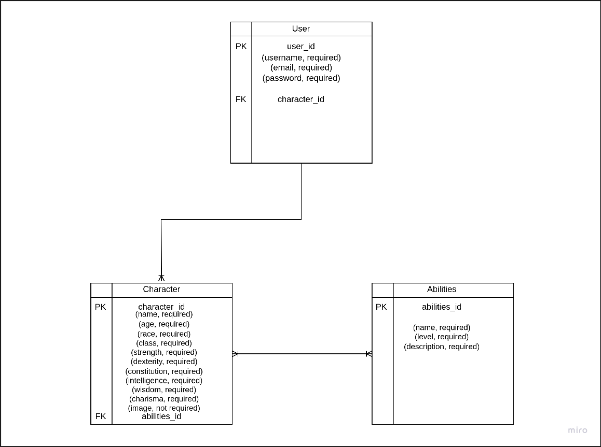

# homebrew-character-builder
An app built using Django that helps you build custom characters for table-top games
Characters will be able to have multiple abilities.

## ERD

## User Story

## Wireframe
